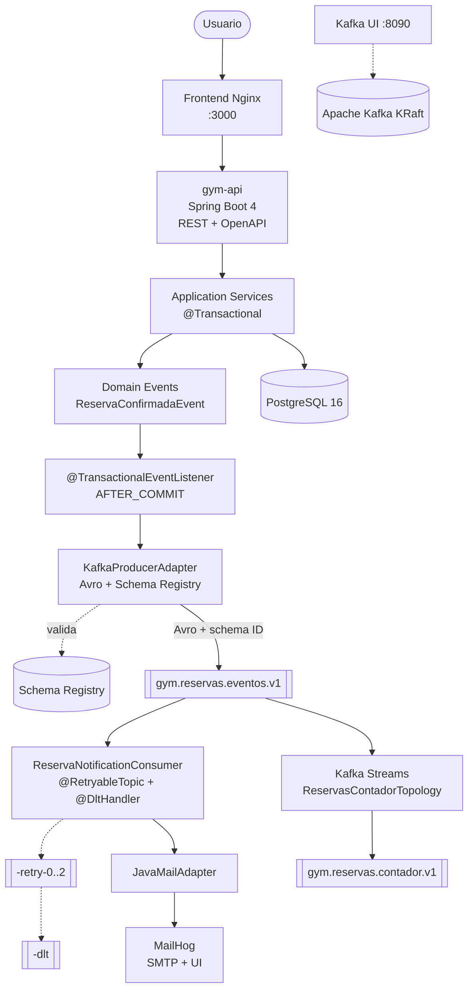
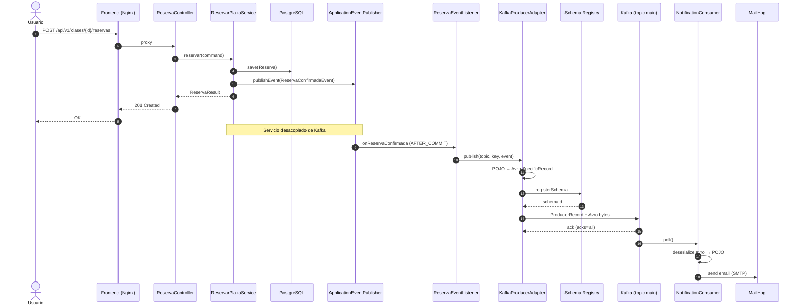
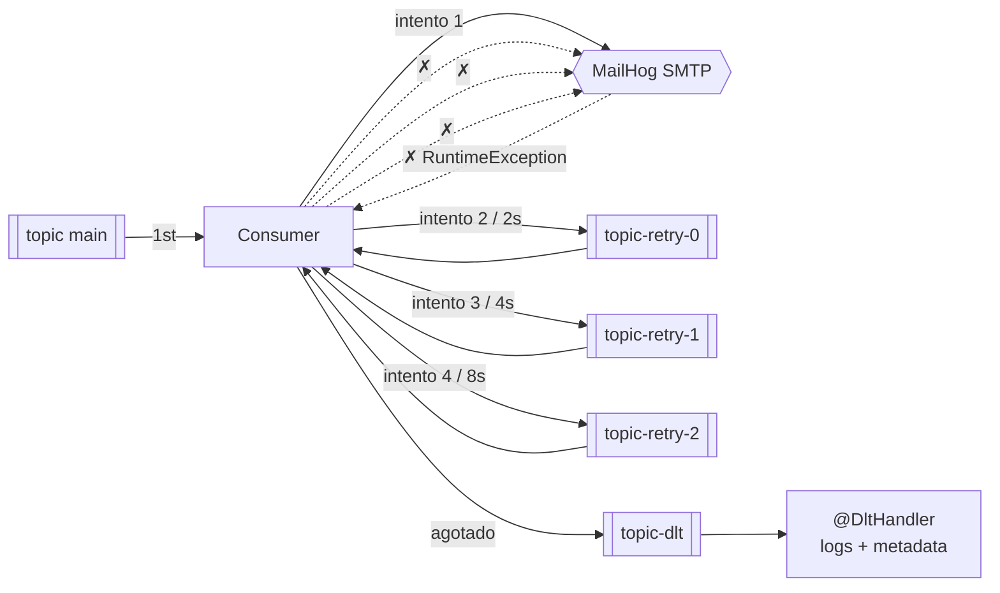
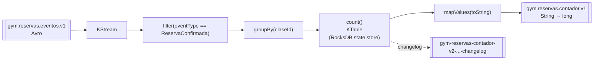

# Diagramas de Arquitectura — Gimnasio Reservas + Kafka

## 1. Arquitectura General

```mermaid
flowchart TB
    User([Usuario])
    Front["Frontend Nginx<br/>:3000"]
    Api["gym-api<br/>Spring Boot 4<br/>REST + OpenAPI"]
    Services["Application Services<br/>@Transactional"]
    Events["Domain Events<br/>ReservaConfirmadaEvent"]
    Listener["@TransactionalEventListener<br/>AFTER_COMMIT"]
    Producer["KafkaProducerAdapter<br/>Avro + Schema Registry"]
    Consumer["ReservaNotificationConsumer<br/>@RetryableTopic + @DltHandler"]
    Mail["JavaMailAdapter"]
    Streams["Kafka Streams<br/>ReservasContadorTopology"]
    DB[(PostgreSQL 16)]
    Kafka[(Apache Kafka KRaft)]
    Registry[(Schema Registry)]
    UI[Kafka UI :8090]
    MailHog[MailHog<br/>SMTP + UI]
    TMain[[gym.reservas.eventos.v1]]
    TRetry[[-retry-0..2]]
    TDlt[[-dlt]]
    TCont[[gym.reservas.contador.v1]]

    User --> Front
    Front --> Api
    Api --> Services
    Services --> Events
    Events --> Listener
    Listener --> Producer
    Producer -->|"Avro + schema ID"| TMain
    Producer -.->|valida| Registry
    TMain --> Consumer
    Consumer -.-> TRetry
    TRetry -.-> TDlt
    Consumer --> Mail
    Mail --> MailHog
    Services --> DB
    TMain --> Streams
    Streams --> TCont
    UI -.-> Kafka
```
## 2. Flujo exitoso: reserva → correo

```mermaid
sequenceDiagram
    autonumber
    actor U as Usuario
    participant F as Frontend (Nginx)
    participant C as ReservaController
    participant S as ReservarPlazaService
    participant DB as PostgreSQL
    participant P as ApplicationEventPublisher
    participant L as ReservaEventListener
    participant K as KafkaProducerAdapter
    participant R as Schema Registry
    participant T as Kafka (topic main)
    participant N as NotificationConsumer
    participant M as MailHog

    U->>F: POST /api/v1/clases/{id}/reservas
    F->>C: proxy
    C->>S: reservar(command)
    S->>DB: save(Reserva)
    S->>P: publishEvent(ReservaConfirmadaEvent)
    S-->>C: ReservaResult
    C-->>F: 201 Created
    F-->>U: OK

    Note over S,P: Servicio desacoplado de Kafka

    P->>L: onReservaConfirmada (AFTER_COMMIT)
    L->>K: publish(topic, key, event)
    K->>K: POJO → Avro SpecificRecord
    K->>R: registerSchema
    R-->>K: schemaId
    K->>T: ProducerRecord + Avro bytes
    T-->>K: ack (acks=all)

    T->>N: poll()
    N->>N: deserialize Avro → POJO
    N->>M: send email (SMTP)
```

## 3. Flujo con fallo: retry + DLT

```mermaid
flowchart LR
    T0[[topic main]] -->|1st| C[Consumer]
    C -->|intento 1| M{{MailHog SMTP}}
    M -.->|✗ RuntimeException| C
    C -->|intento 2 / 2s| R0[[topic-retry-0]]
    R0 --> C
    C -.->|✗| M
    C -->|intento 3 / 4s| R1[[topic-retry-1]]
    R1 --> C
    C -.->|✗| M
    C -->|intento 4 / 8s| R2[[topic-retry-2]]
    R2 --> C
    C -.->|✗| M
    C -->|agotado| DLT[[topic-dlt]]
    DLT --> DH["@DltHandler<br/>logs + metadata"]
```
## 4. Topología Kafka Streams

```mermaid
flowchart LR
    IN[[gym.reservas.eventos.v1<br/>Avro]] --> S[KStream<String, ReservaConfirmadaEvent>]
    S --> F["filter(eventType == ReservaConfirmada)"]
    F --> G["groupBy(claseId)"]
    G --> C["count()<br/>KTable<String, Long><br/>(RocksDB state store)"]
    C --> M["mapValues(toString)"]
    M --> OUT[[gym.reservas.contador.v1<br/>String → long]]
    C -.->|changelog| CH[[gym-reservas-contador-v2-...-changelog]]
```